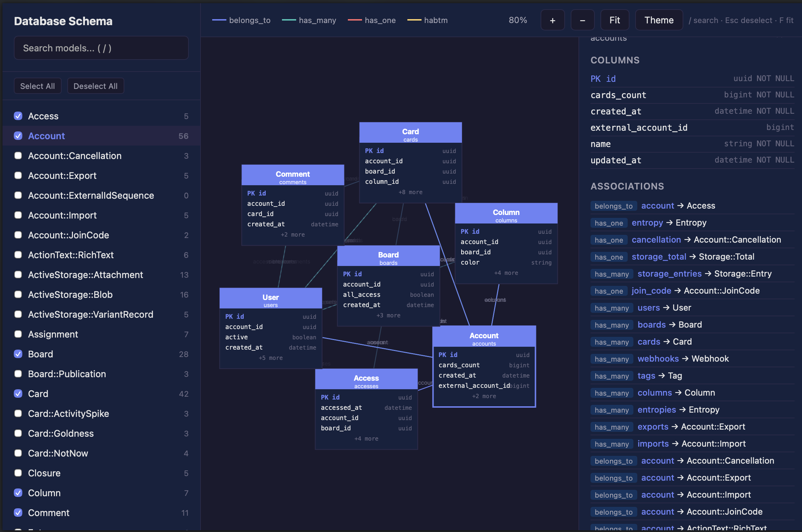

# Rails::Schema

Interactive HTML visualization of your Rails database schema. Introspects your app's models, associations, and columns, then generates a single self-contained HTML file with an interactive entity-relationship diagram.

No external server, no CDN — just one command and a browser.

**[Live example](https://andrew2net.github.io/rails-schema/)** — generated from [Fizzy](https://www.fizzy.do), a modern spin on kanban for tracking just about anything, created by [37signals](https://37signals.com).



## Installation

Add to your Gemfile:

```ruby
gem "rails-schema", group: :development
```

Then run:

```bash
bundle install
```

## Usage

### Rake task

```bash
rake rails_schema:generate
```

This generates `docs/schema.html` by default. Open it in your browser.

### Programmatic

```ruby
Rails::Schema.generate(output: "docs/schema.html")
```

## Configuration

Create an initializer at `config/initializers/rails_schema.rb`:

```ruby
Rails::Schema.configure do |config|
  config.output_path = "docs/schema.html"
  config.title = "My App Schema"
  config.theme = :auto          # :auto, :light, or :dark
  config.expand_columns = false # start with columns collapsed
  config.schema_format = :auto  # :auto, :ruby, or :sql
  config.exclude_models = [
    "ActiveStorage::Blob",
    "ActiveStorage::Attachment",
    "ActionMailbox::*"           # wildcard prefix matching
  ]
end
```

| Option | Default | Description |
|--------|---------|-------------|
| `output_path` | `"docs/schema.html"` | Path for the generated HTML file |
| `title` | `"Database Schema"` | Title shown in the HTML page |
| `theme` | `:auto` | Color theme — `:auto`, `:light`, or `:dark` |
| `expand_columns` | `false` | Whether model nodes start with columns expanded |
| `schema_format` | `:auto` | Schema source — `:auto`, `:ruby`, or `:sql` (see below) |
| `exclude_models` | `[]` | Models to hide; supports exact names and wildcard prefixes (`"ActionMailbox::*"`) |

### Schema format

Rails projects can use either `db/schema.rb` (Ruby DSL) or `db/structure.sql` (raw SQL dump) to represent the database schema. Set `config.active_record.schema_format = :sql` in your Rails app to use `structure.sql`.

| Value | Behavior |
|-------|----------|
| `:auto` | Tries `db/schema.rb` first, falls back to `db/structure.sql` |
| `:ruby` | Only reads `db/schema.rb` |
| `:sql` | Only reads `db/structure.sql` |

## How it works

The gem parses your `db/schema.rb` or `db/structure.sql` file to extract table and column information — **no database connection required**. It also introspects loaded ActiveRecord models for association metadata. This means the gem works even if you don't have a local database set up, as long as a schema file is present (which is standard in Rails projects under version control).

## Features

- **No database required** — reads from `db/schema.rb` or `db/structure.sql`
- **Force-directed layout** — models cluster naturally by association density
- **Searchable sidebar** — filter models by name or table
- **Click-to-focus** — click a model to highlight its neighborhood, fading unrelated models
- **Detail panel** — full column list and associations for the selected model
- **Dark/light theme** — toggle or auto-detect from system preference
- **Zoom & pan** — scroll wheel, pinch, or buttons
- **Keyboard shortcuts** — `/` search, `Esc` deselect, `+/-` zoom, `F` fit to screen
- **Self-contained** — single HTML file with all CSS, JS, and data inlined

## License

The gem is available as open source under the terms of the [MIT License](https://opensource.org/licenses/MIT).
