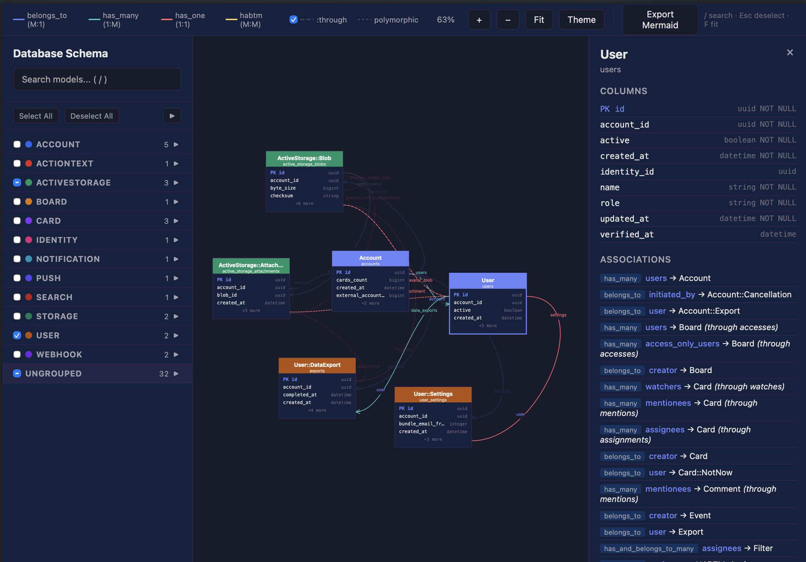

# Rails::Schema

Interactive HTML visualization of your Rails database schema. Introspects your app's models, associations, and columns, then generates a single self-contained HTML file with an interactive entity-relationship diagram.

No external server, no CDN — just one command and a browser.

## Compatibility

| Dependency | Required version |
|-----------|-----------------|
| Ruby | >= 2.7 |
| Rails | >= 5.2 |

**[Live example](https://andrew2net.github.io/rails-schema/)** — generated from [Fizzy](https://www.fizzy.do), a modern spin on kanban for tracking just about anything, created by [37signals](https://37signals.com).



## Installation

Add to your Gemfile:

```ruby
gem "rails-schema", group: :development
```

Then run:

```bash
bundle install
```

## Usage

### Rake task

```bash
rake rails_schema:generate
```

This generates `docs/schema.html` by default. Open it in your browser.

### Programmatic

```ruby
Rails::Schema.generate(output: "docs/schema.html")
```

## Configuration

Create an initializer at `config/initializers/rails_schema.rb`:

```ruby
Rails::Schema.configure do |config|
  config.output_path = "docs/schema.html"
  config.title = "My App Schema"
  config.theme = :auto          # :auto, :light, or :dark
  config.expand_columns = false # start with columns collapsed
  config.schema_format = :auto  # :auto, :ruby, :sql, or :mongoid
  config.exclude_models = [
    "ActiveStorage::Blob",
    "ActiveStorage::Attachment",
    "ActionMailbox::*"           # wildcard prefix matching
  ]
  config.exclude_model_if = ->(model) { model.table_name.start_with?("_") }
  config.model_schema_group = :namespaces  # group models by Ruby namespace
  config.collapse_groups = true            # start with groups collapsed
  config.show_through_edges = true         # show :through edges on the diagram
end
```

| Option | Default | Description |
|--------|---------|-------------|
| `output_path` | `"docs/schema.html"` | Path for the generated HTML file |
| `title` | `"Database Schema"` | Title shown in the HTML page |
| `theme` | `:auto` | Color theme — `:auto`, `:light`, or `:dark` |
| `expand_columns` | `false` | Whether model nodes start with columns expanded |
| `schema_format` | `:auto` | Schema source — `:auto`, `:ruby`, `:sql`, or `:mongoid` (see below) |
| `exclude_models` | `[]` | Models to hide; supports exact names and wildcard prefixes (`"ActionMailbox::*"`) |
| `exclude_model_if` | `nil` | A proc/lambda that receives a model class and returns `true` to exclude it |
| `model_schema_group` | `nil` | Group models visually — `:namespaces`, or a custom proc (see below) |
| `collapse_groups` | `true` | Whether sidebar groups start collapsed |
| `show_through_edges` | `true` | Whether `:through` association edges are shown on the diagram initially (toggleable at runtime via legend checkbox) |

### Schema format

Rails projects can use either `db/schema.rb` (Ruby DSL) or `db/structure.sql` (raw SQL dump) to represent the database schema. Set `config.active_record.schema_format = :sql` in your Rails app to use `structure.sql`.

| Value | Behavior |
|-------|----------|
| `:auto` | Tries `db/schema.rb` first, falls back to `db/structure.sql`. If Mongoid is detected, uses the Mongoid pipeline instead |
| `:ruby` | Only reads `db/schema.rb` |
| `:sql` | Only reads `db/structure.sql` |
| `:mongoid` | Introspects Mongoid models directly (see below) |

### Mongoid support

If your app uses [Mongoid](https://www.mongodb.com/docs/mongoid/current/) instead of ActiveRecord, rails-schema can introspect your Mongoid models directly — no schema file needed.

```ruby
Rails::Schema.configure do |config|
  config.schema_format = :mongoid
end
```

When set to `:auto`, Mongoid mode activates automatically if `Mongoid::Document` is defined.

The Mongoid pipeline reads fields, types, defaults, and presence validations from your models, and discovers all association types including `embeds_many`, `embeds_one`, `embedded_in`, and `has_and_belongs_to_many`.

### Model grouping

Group models visually by assigning each group a distinct header color in the diagram and organizing them under collapsible headers in the sidebar.

**By namespace** — splits on `::` and groups by the namespace path:

```ruby
Rails::Schema.configure do |config|
  config.model_schema_group = :namespaces
end
```

This groups `Admin::Dashboard` under "Admin" and `Admin::Reports::Summary` under "Admin > Reports". Non-namespaced models like `User` remain ungrouped.

**Custom proc** — return an array representing the group hierarchy:

```ruby
Rails::Schema.configure do |config|
  config.model_schema_group = proc do |model|
    case model.name
    when /^Admin::/ then ["Admin"]
    when /^Billing::/ then ["Billing"]
    else ["Core"]
    end
  end
end
```

Returning `["A", "B"]` means group "A" with subgroup "B". Returning `[]` or `nil` leaves the model ungrouped.

**Sidebar behavior with grouping enabled:**

- Each group has a **checkbox** to select/deselect all models in the group (supports indeterminate state for partial selection)
- **Double-click** a group header to isolate that group — selects only its models and deselects everything else
- **Click** a group header to collapse/expand its model list
- A **collapse/expand all** button (▼/▶) appears in the sidebar actions bar to toggle all groups at once
- Model names are **color-coded** to match their group's color
- The **group header highlights** when one of its models is selected on the diagram
- Models in the same group **cluster together** in the force-directed layout

## How it works

The gem parses your `db/schema.rb` or `db/structure.sql` file to extract table and column information — **no database connection required**. It also introspects loaded ActiveRecord models for association metadata. This means the gem works even if you don't have a local database set up, as long as a schema file is present (which is standard in Rails projects under version control).

For Mongoid apps, the gem introspects model classes at runtime to read field definitions, associations, and validations — no schema file or database connection required.

### Packwerk support

If your app uses [Packwerk](https://github.com/Shopify/packwerk) for modular monolith architecture, rails-schema automatically discovers models inside packages. It reads your `packwerk.yml` to find `package_paths`, then looks for models in `app/models` and `app/public` under each package that has a `package.yml`. No configuration needed — it works out of the box.

If the targeted loading doesn't find any models, the gem falls back to a full eager load of the entire application.

## Features

- **No database required** — reads from `db/schema.rb`, `db/structure.sql`, or Mongoid model introspection
- **Model grouping** — group models by namespace or custom logic; each group gets a distinct color for node headers and sidebar model names, collapsible sidebar sections with checkboxes, a collapse/expand-all toggle, group header highlighting on model selection, and force-layout clustering
- **Force-directed layout** — models cluster naturally by association density; self-referential-only models are placed in a left column, true orphans in rows above
- **Searchable sidebar** — filter models by name or table, with a clear button to reset
- **Select/Deselect All** — operates on filtered (visible) models only, so you can search and bulk-toggle a subset; when all models are selected and a search filter is active, "Select All" narrows the selection to only the filtered models
- **Shift-click range selection** — hold Shift and click checkboxes to toggle a range at once
- **Click-to-focus** — click a model to highlight its neighborhood, fading unrelated models
- **Double-click to isolate** — double-click a model to filter the view to only that model and its direct neighbors
- **Through edges toggle** — checkbox in the legend to show/hide `:through` association edges on the diagram; through associations always remain visible in the detail panel regardless of toggle state
- **Manual Positioning** — toolbar checkbox that removes all simulation forces; nodes stay exactly where you drop them and drag-and-drop continues to work normally; uncheck to re-enable automatic force-directed layout
- **Detail panel** — full column list and associations for the selected model; clicking a relation link auto-selects the related model (adding it to the diagram if hidden)
- **Dark/light theme** — toggle or auto-detect from system preference
- **Zoom & pan** — scroll wheel, pinch, or buttons
- **Keyboard shortcuts** — `/` search, `Esc` deselect, `+/-` zoom, `F` fit to screen
- **Export to Mermaid** — download the diagram as a `.mmd` file for use in Markdown, GitHub, or other tools that render Mermaid ER diagrams; respects sidebar visibility filters so you can export a subset of models
- **Deduplicated edges** — reciprocal associations (e.g. `has_many :posts` / `belongs_to :user`, or symmetric HABTM) are merged into a single edge with dual labels, each colored by its own association type
- **Self-contained** — single HTML file with all CSS, JS, and data inlined

## Support

If you find this gem useful, consider [buying me a coffee](https://www.paypal.com/donate/?hosted_button_id=5PZC9UEJWFJYJ).

## License

The gem is available as open source under the terms of the [MIT License](https://opensource.org/licenses/MIT).
